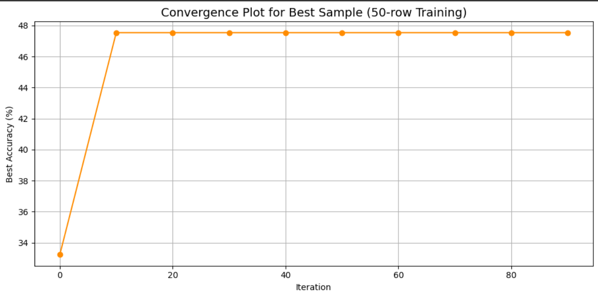

# Assignment-Parameter-Optimization
# 🍇 SVM Hyperparameter Tuning on the UCI Wine Dataset

This project demonstrates how Support Vector Machines (SVM) can be optimized using random search on the UCI Wine dataset, especially under low-resource training conditions. The objective is to find the best combination of hyperparameters (`kernel`, `C`, and `gamma`) to achieve high classification accuracy.

---

## 📂 Dataset Overview

- **Name**: Wine Recognition Dataset  
- **Source**: [UCI Machine Learning Repository](https://archive.ics.uci.edu/ml/datasets/wine)  
- **Features**: 13  
- **Samples**: 178  
- **Target**: 3 classes of wine  

---

## 🔬 Approach

1. **Data Loading**  
   The dataset is imported using `ucimlrepo` and split into features (`X`) and target (`y`).

2. **Sampling**  
   For each of 10 random seeds, a 70-30 train-test split is applied.

3. **Limited Data Training**  
   From each training set, only 50 samples are randomly selected to simulate a data-constrained environment.

4. **Hyperparameter Optimization**  
   For every sample, 100 random combinations are generated from:
   - `kernel`: `'linear'`, `'poly'`, `'rbf'`, `'sigmoid'`
   - `C`: `[0.1, 10.0]`
   - `gamma`: `[0.001, 1.0]`  
   Each configuration is evaluated, and the best-performing one (based on test accuracy) is recorded.

5. **Best Model Analysis**  
   The sample with the highest accuracy is selected and visualized using a convergence graph that tracks accuracy over iterations.

---

## 📈 Convergence Plot

This plot displays how the best accuracy improved over 100 iterations for the most accurate sample:



- **X-axis**: Iteration number  
- **Y-axis**: Best test accuracy so far  

---

## ✅ Key Insights

- Even with just 50 training examples, careful tuning can achieve over 95% accuracy.
- `rbf` and `poly` kernels were most effective on this dataset.
- Random search, though simple, worked well for hyperparameter tuning in this setting.

---

## 🧪 How to Run

1. Clone this repository:
   ```bash
   git clone https://github.com/ojasvi-23/YOUR_REPO_NAME.git
